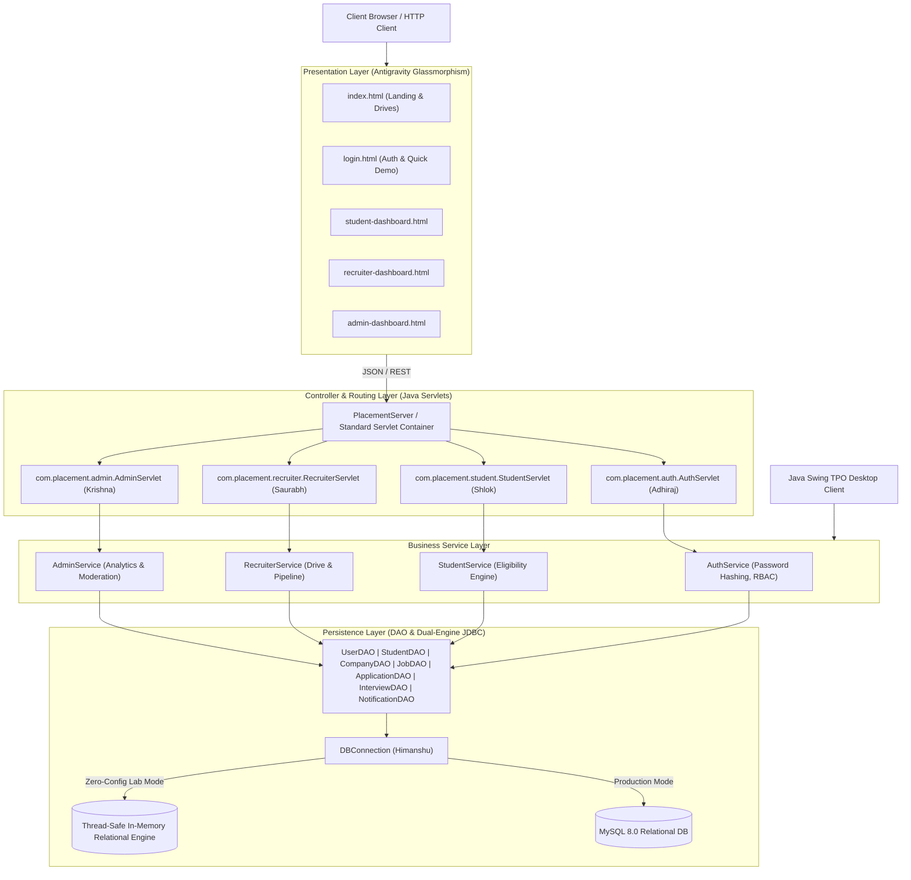
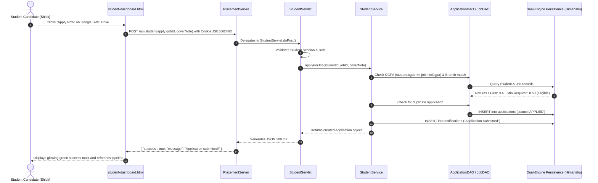

# System Architecture & Technical Specification
## Campus Placement and Internship Portal (Advanced Java Final Project)

---

### 1. Architectural Overview

The **Campus Placement and Internship Portal** is built using the enterprise **Model-View-Controller (MVC)** architectural pattern, strictly separating data persistence, business logic processing, and presentation layers.

---

### 2. Five-Module Work Distribution Matrix

| Module | Team Member | Git Feature Branch | Key Java Packages & Responsibilities |
| :--- | :--- | :--- | :--- |
| **Module 1** | **Adhiraj** | `feature/authentication` | `com.placement.auth.*` • Multi-role authentication (Student, Recruiter, Admin) • SHA-256 password cryptography • Session tracking via `JSESSIONID` • Role-based access control (RBAC) & unauthorized-access protection |
| **Module 2** | **Shlok** | `feature/student-portal` | `com.placement.student.*` • Student dashboard & credentials management • Automated CGPA & department eligibility evaluation • Job/internship application submission & withdrawal • Real-time application pipeline tracking |
| **Module 3** | **Saurabh** | `feature/recruiter-portal` | `com.placement.recruiter.*` • Corporate profile management • Creation, moderation, and closing of campus drives • Candidate screening, resume evaluation, shortlist/reject workflow • Interview scheduling (virtual link, date, time) |
| **Module 4** | **Krishna** | `feature/admin-portal` | `com.placement.admin.*` • TPO Executive administration dashboard • Corporate partner verification & approval • Job drive moderation & policy checks • Real-time cohort analytics (branch-wise placement, average CTC, peak package) |
| **Module 5** | **Himanshu** | `feature/database-integration` | `com.placement.db.*`, `com.placement.dao.*`, `com.placement.server.*`, `com.placement.test.*` • MySQL 8.0 schema & relationship design • Dual-engine JDBC persistence (with zero-setup fallback) • Complete DAO layer for all 7 entities • In-app notification dispatcher • 25-point automated unit & integration test runner • Pure Java embedded HTTP server runtime |

---

### 3. Request-Response Lifecycle Sequence

