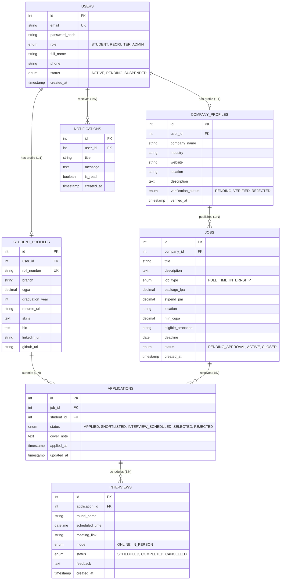

# Entity-Relationship (ER) Documentation
## Campus Placement and Internship Portal Database

---

### 1. Conceptual Entity-Relationship Diagram

---

### 2. Relational Integrity Rules & Constraints

1. **Foreign Key Cascades:**
   - Deleting a `USER` automatically cascades to delete their associated `STUDENT_PROFILE` or `COMPANY_PROFILE`, along with their `NOTIFICATIONS`.
   - Deleting a `COMPANY_PROFILE` removes all associated `JOBS`, which cascades to remove all associated `APPLICATIONS` and `INTERVIEWS`.
2. **Duplicate Application Prevention:**
   - A unique compound key `uk_student_job (student_id, job_id)` prevents a candidate from submitting duplicate applications for the same campus drive.
3. **Auditability & Timestamps:**
   - `applications` tracks both initial `applied_at` and live `updated_at` timestamps to maintain transparency across recruiter status transitions.
