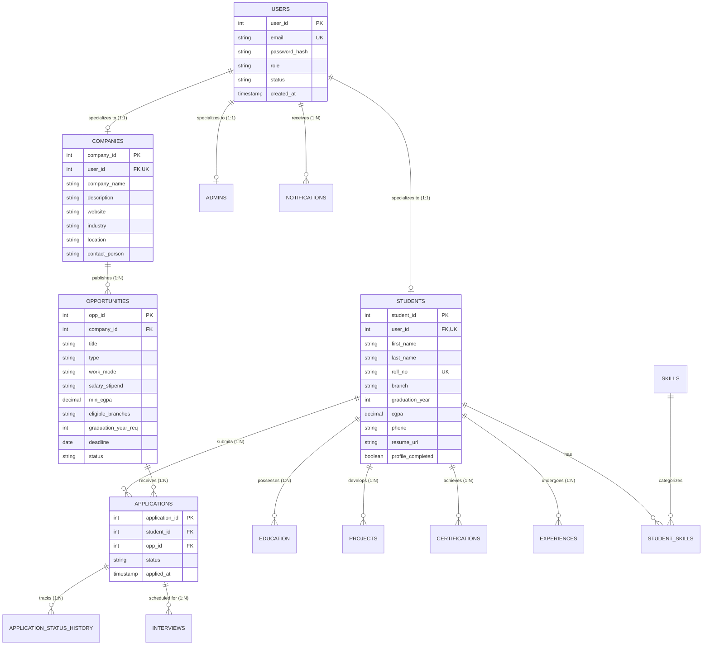

# Entity-Relationship Specification & Conceptual Data Model
## Module 5: Database Architecture, Integration Layer & System Testing
### Author: Himanshu Yadav ([@XXHimanshuXX](https://github.com/XXHimanshuXX) | [LinkedIn](https://www.linkedin.com/in/himanshu-yadav-112ba6376))
### Contact: himanshu.yadav060107@gmail.com
### Project: Campus Placement and Internship Portal

---

## 1. Overview of Conceptual Data Model

The **Campus Placement and Internship Portal** requires a normalized relational model capable of expressing role-based user hierarchy, one-to-one profile specializations, one-to-many opportunity listings, many-to-many application bindings, and nested multi-attribute student resumes.

During Week 1, 15 core and auxiliary entities were identified and modeled into an Entity-Relationship (ER) diagram ensuring high coherence and minimal redundancy.

---

## 2. Entity-Relationship Diagram (ERD)

---

## 3. Entity Catalog & Semantic Definitions

### 3.1 Authentication & Principal Entities
- **`users`**: Base authentication table capturing global login credentials, hashed password tokens, role enumeration (`STUDENT`, `RECRUITER`, `ADMIN`), and account activation state.
- **`students`**: Role specialization table for candidates. Houses academic markers (`roll_no`, `branch`, `graduation_year`, `cgpa`) and flags profile completeness.
- **`companies`**: Role specialization table for recruiting corporations. Stores corporate identity, sector, and primary contact personnel.
- **`admins`**: Role specialization table for university placement officers holding operational supervision authority.

### 3.2 Opportunity & Application Pipeline Entities
- **`opportunities`**: Job drives and internship postings authored by companies. Encapsulates automated filter thresholds (`min_cgpa`, `eligible_branches`, `graduation_year_req`, `deadline`).
- **`applications`**: Junction entity binding `students` to `opportunities` with a strict `UNIQUE(student_id, opp_id)` constraint preventing duplicate attempts.
- **`application_status_history`**: Audit ledger tracking every transition (`APPLIED` $\rightarrow$ `UNDER_REVIEW` $\rightarrow$ `SHORTLISTED` $\rightarrow$ `INTERVIEW_SCHEDULED` $\rightarrow$ `SELECTED`/`REJECTED`) with timestamps and evaluator remarks.
- **`interviews`**: Event entity recording specific evaluation sessions (date, time, modality, web link, instructions) linked directly to applications.

### 3.3 Dynamic Student Profile Portfolio Entities
- **`education`**: Multi-record educational credentials (degree, institution, passing year, score percentage).
- **`skills` & `student_skills`**: Normalized catalog of industry competencies (`Java`, `MySQL`, `React`, `Data Structures`) linked via associative entity to students.
- **`projects`**: Technical software and hardware portfolio projects with live source repository hyperlinks.
- **`certifications`**: Professional credentials issued by verified authorities.
- **`experiences`**: Prior internship and employment experiences documenting corporate tenures.
- **`notifications`**: User-specific asynchronous alerts regarding drive updates, shortlisting events, and interview schedules.

---

## 4. Cardinality & Relationship Constraints

1. **User Specialization (1:1 Exclusive)**:
   - Every `users` record corresponds to at most one record in either `students`, `companies`, or `admins`.
   - Maintained via `FOREIGN KEY (user_id) REFERENCES users(user_id) ON DELETE CASCADE` with `UNIQUE(user_id)`.
2. **Company to Opportunities (1:N)**:
   - One company can publish multiple jobs/internships; an opportunity belongs strictly to one company.
3. **Student to Applications to Opportunity (M:N via Junction)**:
   - A student may apply to multiple opportunities; an opportunity receives multiple applications.
   - Enforced by `applications` with composite uniqueness on `(student_id, opp_id)`.
4. **Application to Status History (1:N)**:
   - Full sequential audit trail preserves the timeline of recruiter actions.
