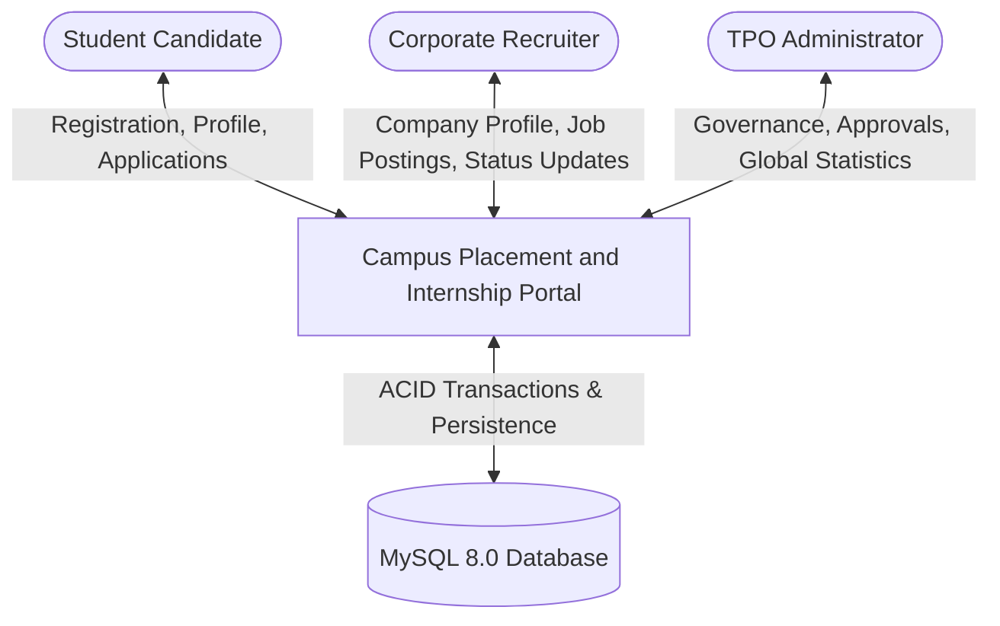
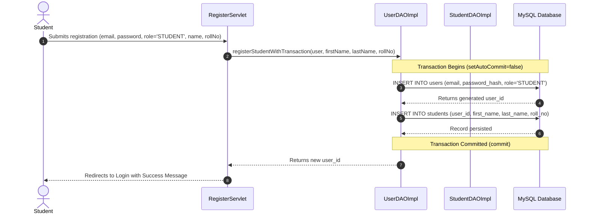
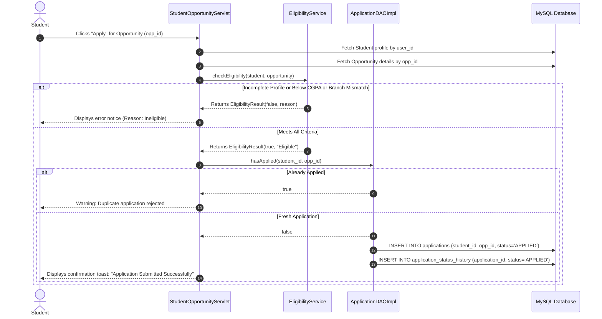
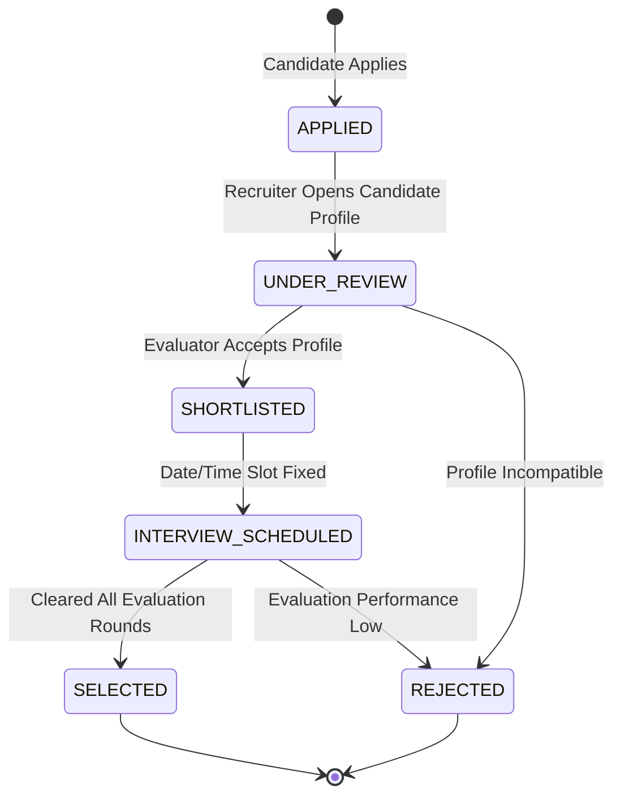

# Data Flow and Lifecycle Analysis
## Module 5: Database Architecture, Integration Layer & System Testing
### Author: Himanshu Yadav ([@XXHimanshuXX](https://github.com/XXHimanshuXX) | [LinkedIn](https://www.linkedin.com/in/himanshu-yadav-112ba6376))
### Contact: himanshu.yadav060107@gmail.com
### Project: Campus Placement and Internship Portal

---

## 1. Data Flow Overview

To ensure high data cohesion between the front-end presentation views (JSP), the HTTP controllers (Java Servlets), and the persistence tier (JDBC / MySQL), a systematic Data Flow Diagram (DFD) analysis was conducted during Week 1.

The system processes data across three distinct lifecycles:
1. **User Identity & Onboarding Lifecycle**
2. **Opportunity Authoring & Publishing Lifecycle**
3. **Application Screening & Interview Dispatch Lifecycle**

---

## 2. Level 0: Context Data Flow Diagram

---

## 3. Level 1: Core Subsystem Data Flows

### 3.1 Student Registration & Profile Completion Workflow

### 3.2 Automated Eligibility & Application Submission Workflow

### 3.3 Recruiter Screening & Status Progression Workflow

---

## 4. Concurrency Control and Data Integrity

1. **Duplicate Prevention**: The combination of `student_id` and `opp_id` in the `applications` table is strictly bound by a `UNIQUE` composite key. Any race condition where two rapid clicks occur is absorbed gracefully with an `SQLIntegrityConstraintViolationException` caught in `ApplicationDAOImpl`.
2. **Cascading Deletions**: Deleting a user account cascades to remove associated student/company records, their application records, portfolio details, and notifications, ensuring no orphan rows clutter the database.
3. **Auditing**: Every status change triggered by a recruiter or admin inserts a record into `application_status_history` logging the previous state, new state, user ID of the updater, and optional evaluation remarks.
