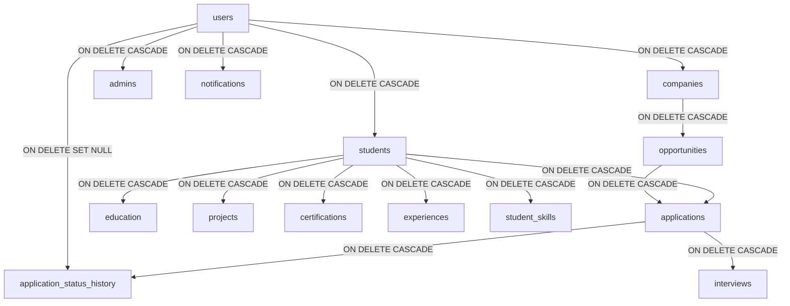

# Relational Schema Design & Normalization Analysis
## Module 5: Database Architecture, Integration Layer & System Testing
### Author: Himanshu Yadav ([@XXHimanshuXX](https://github.com/XXHimanshuXX) | [LinkedIn](https://www.linkedin.com/in/himanshu-yadav-112ba6376))
### Contact: himanshu.yadav060107@gmail.com
### Project: Campus Placement and Internship Portal

---

## 1. Schema Architecture Principles

The relational schema for the **Campus Placement and Internship Portal** is architected to balance transactional integrity, querying speed, and structural extensibility. During Week 2, the conceptual ER model from Week 1 was transformed into a strict Third Normal Form (3NF) relational design implemented in MySQL 8.0.

### Core Architectural Goals:
1. **Zero Redundancy**: Prevent duplicate storage of mutable user credentials, contact details, and qualifications.
2. **Referential Integrity**: Guarantee database-enforced foreign key constraints with explicit cascading behavior.
3. **Optimized B-Tree Indexing**: Enable high-speed lookups on foreign keys, email lookups, and recruitment status queries.

---

## 2. Normalization Analysis (1NF to 3NF)

### 2.1 First Normal Form (1NF)
- **Criterion**: All attributes must be atomic; no multi-valued attributes or repeating groups.
- **Implementation**:
  - Rather than storing education histories as delimited strings within `students`, a separate `education` entity was created where each qualification record is stored as an atomic row.
  - Skills are segregated into a standalone `skills` lookup catalog and an associative `student_skills` mapping table, eliminating comma-separated arrays of skills in student profiles.

### 2.2 Second Normal Form (2NF)
- **Criterion**: The table must be in 1NF, and all non-key attributes must be fully functionally dependent on the entire primary key (no partial dependencies).
- **Implementation**:
  - In `applications`, the primary key is `application_id`. Attributes such as `status` and `applied_at` depend solely on the single candidate-job application instance.
  - In the junction table `student_skills`, the composite key is `(student_id, skill_id)`. There are no partial attributes; it serves strictly as a binary association.

### 2.3 Third Normal Form (3NF)
- **Criterion**: The table must be in 2NF, and no non-key attribute may be transitively dependent on another non-key attribute (elimination of transitive dependencies $X \rightarrow Y \rightarrow Z$).
- **Implementation**:
  - Company attributes (`company_name`, `website`, `industry`, `location`) are housed strictly in `companies`. The `opportunities` table holds only the foreign key `company_id`. It does not duplicate company meta-attributes.
  - Similarly, candidate academic credentials (`cgpa`, `branch`) reside exclusively in `students`. Applications hold only `student_id` and `opp_id`.

---

## 3. Referential Integrity & Cascade Strategies

### Cascade Policy Summary:
1. **User Deletion (`ON DELETE CASCADE`)**:
   - If a student or company account is deleted, all affiliated records (profile, applications, projects, experiences, drives) are automatically pruned by InnoDB, preventing orphaned child rows.
2. **Audit Attribution (`ON DELETE SET NULL`)**:
   - In `application_status_history`, if an admin or recruiter user account is purged, `changed_by` is set to `NULL`, preserving the immutable application audit trail while respecting referential integrity.
3. **Application Uniqueness (`UNIQUE(student_id, opp_id)`)**:
   - Hard database constraint prevents duplicate job applications at the storage engine layer, eliminating race conditions from concurrent network requests.

---

## 4. Performance & Indexing Strategy

To guarantee sub-50ms query latency under heavy concurrent campus drive traffic:
- **Clustered Indexes**: Primary keys (`AUTO_INCREMENT INT`) automatically form the primary clustered index in InnoDB.
- **Unique Indexes**:
  - `users.email` — High-speed authentication query during login.
  - `students.roll_no` — Instant student academic identification.
  - `skills.skill_name` — Fast deduplication when adding technical competencies.
- **Foreign Key B-Tree Indexes**: MySQL automatically builds B-Tree indexes on foreign keys (`user_id`, `company_id`, `student_id`, `opp_id`, `application_id`), expediting join operations in recruiter review queries.
