# JDBC Architecture & Connection Management
## Module 5: Database Architecture, Integration Layer & System Testing
### Author: Himanshu Yadav ([@XXHimanshuXX](https://github.com/XXHimanshuXX) | [LinkedIn](https://www.linkedin.com/in/himanshu-yadav-112ba6376))
### Contact: himanshu.yadav060107@gmail.com
### Project: Campus Placement and Internship Portal

---

## 1. JDBC Architecture Overview

Java Database Connectivity (JDBC) forms the backbone of data persistence in our Pure Java enterprise placement application. It provides an abstraction layer between Java Servlets / Business Services and the MySQL database engine.

In Week 3, I developed the centralized `DatabaseConnection` class (`com.placement.util.DatabaseConnection`), which standardizes driver loading, socket connection parameters, and exception handling across all DAO components.

```mermaid
flowchart LR
    S[Servlets / Services] -->|Invoke CRUD Methods| DAO[DAO Layer: UserDAO, StudentDAO, etc.]
    DAO -->|DatabaseConnection.getConnection| DC[DatabaseConnection Factory]
    DC -->|DriverManager.getConnection| DM[JDBC DriverManager]
    DM -->|Type 4 Network Socket| DRV[MySQL Connector/J Driver]
    DRV -->|TCP/IP Port 3306 / 18967 SSL| DB[(MySQL Server / Cloud DB)]
```



---

## 2. Key Architectural Decisions in `DatabaseConnection`

### 2.1 Static Initializer Driver Registration
```java
static {
    try {
        Class.forName("com.mysql.cj.jdbc.Driver");
    } catch (ClassNotFoundException e) {
        throw new RuntimeException("Failed to load MySQL JDBC Driver.", e);
    }
}
```
- **Rationale**: `Class.forName()` invokes the static initialization block of MySQL's Connector/J driver, registering it with Java's `DriverManager` exactly once during classloader execution. This guarantees that driver registration happens before any thread attempts to acquire a connection.

### 2.2 Factory Pattern & Encapsulation
- The class constructor is marked `private` to prevent unnecessary object instantiation.
- Connections are dispensed via the static factory method `DatabaseConnection.getConnection()`.

### 2.3 Cloud SSL and Timezone Security Parameters
```
jdbc:mysql://<host>:<port>/defaultdb?sslMode=REQUIRED&serverTimezone=UTC
```
- **`sslMode=REQUIRED`**: Ensures TLS/SSL encrypted in-transit traffic between the Tomcat server and the remote database instance, protecting sensitive credentials and student resumes.
- **`serverTimezone=UTC`**: Standardizes timestamp storage across local client timezones (IST) and server clocks.

### 2.4 Dynamic Environment Resolution
- The connection class checks for system environment variables (`DB_URL`, `DB_USER`, `DB_PASSWORD`), allowing developers to point to local MySQL or Docker instances seamlessly without modifying source code.

---

## 3. Connection Lifecycle & Resource Management

JDBC connections encapsulate costly OS socket descriptors. Leaving connections unclosed leads to **connection starvation** and database pool exhaustion.

To guarantee zero connection leaks, all DAO implementations are mandated to use Java 7+ **Try-With-Resources**:

```java
// Standard DAO invocation pattern enforced by Module 5
String sql = "SELECT * FROM users WHERE email = ?";
try (Connection conn = DatabaseConnection.getConnection();
     PreparedStatement stmt = conn.prepareStatement(sql)) {
    
    stmt.setString(1, email);
    try (ResultSet rs = stmt.executeQuery()) {
        if (rs.next()) {
            // Process row
        }
    }
} // AutoCloseable automatically closes ResultSet, PreparedStatement, and Connection
```
Even if an unexpected `SQLException` or runtime exception occurs, the JVM guarantees automatic invocation of `conn.close()`, releasing the socket immediately back to the operating system.
