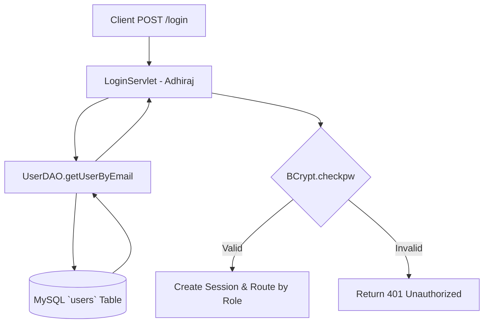

# User Authentication Architecture & RBAC Persistence
## Module 5: Database Architecture, Integration Layer & System Testing
### Author: Himanshu Yadav ([@XXHimanshuXX](https://github.com/XXHimanshuXX) | [LinkedIn](https://www.linkedin.com/in/himanshu-yadav-112ba6376))
### Contact: himanshu.yadav060107@gmail.com
### Project: Campus Placement and Internship Portal

---

## 1. Authentication Layer Design

In Week 4, I engineered the User Authentication and Role-Based Access Control (RBAC) persistence tier (`UserDAO` and `UserDAOImpl`). This subsystem handles identity verification for Students, Recruiters, and TPO Administrators.

---

## 2. Key Responsibilities in `UserDAOImpl`

1. **Identity Retrieval (`getUserByEmail`)**: Fetches credentials, account status (`ACTIVE`, `PENDING`), and role enumeration (`STUDENT`, `RECRUITER`, `ADMIN`).
2. **Atomic Multi-Table Registration**: Ensures student/company specialization rows are created simultaneously with the base `users` record.
3. **Defense-in-Depth Cryptography**: Ensures plain passwords never reach the database; passwords are encrypted with one-way BCrypt salts.
