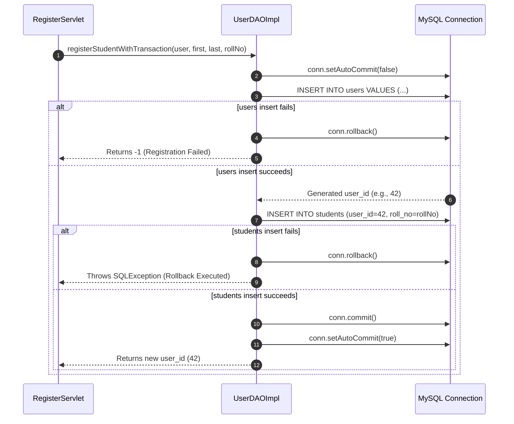

# SQL Injection Defense & Transactional Integrity
## Module 5: Database Architecture, Integration Layer & System Testing
### Author: Himanshu Yadav ([@XXHimanshuXX](https://github.com/XXHimanshuXX) | [LinkedIn](https://www.linkedin.com/in/himanshu-yadav-112ba6376))
### Contact: himanshu.yadav060107@gmail.com
### Project: Campus Placement and Internship Portal

---

## 1. SQL Injection Vulnerability Analysis

SQL Injection (SQLi) is an attack where malicious SQL fragments are injected into application inputs to compromise database queries.

### Insecure Concatenation Example (Vulnerable):
```java
// CRITICAL VULNERABILITY: Never used in Module 5
String sql = "SELECT * FROM users WHERE email = '" + email + "' AND password = '" + pass + "'";
Statement stmt = conn.createStatement();
ResultSet rs = stmt.executeQuery(sql);
```

### Secure Parameterized Query (Enforced Across All DAOs):
```java
// Production standard in UserDAOImpl
String sql = "SELECT * FROM users WHERE email = ?";
try (Connection conn = DatabaseConnection.getConnection();
     PreparedStatement stmt = conn.prepareStatement(sql)) {
    stmt.setString(1, email);
    try (ResultSet rs = stmt.executeQuery()) { ... }
}
```
**Mechanism**: In `PreparedStatement`, the SQL query is pre-compiled by the database engine before parameters are bound. User inputs are treated strictly as literal data values rather than executable code, eliminating SQL injection vectors.

---

## 2. Multi-Table Atomic Transactions

Registration requires creating a base credentials record in `users` followed by a specialized role record in `students` or `companies`.

If the second insertion fails (e.g., due to a duplicate `roll_no` constraint violation), leaving the `users` record in the database creates a corrupted orphaned account.

To enforce the **Atomicity** guarantee of ACID, `UserDAOImpl` implements manual transaction management:


