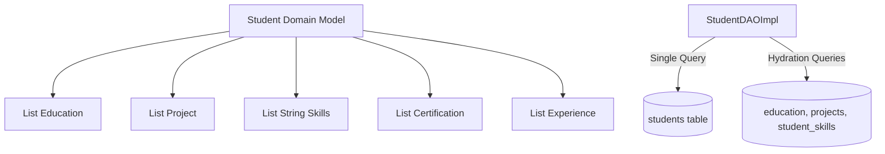

# Dynamic Student Portfolio & Multi-Record Data Architecture
## Module 5: Database Architecture, Integration Layer & System Testing
### Author: Himanshu Yadav ([@XXHimanshuXX](https://github.com/XXHimanshuXX) | [LinkedIn](https://www.linkedin.com/in/himanshu-yadav-112ba6376))
### Contact: himanshu.yadav060107@gmail.com
### Project: Campus Placement and Internship Portal

---

## 1. Portfolio Representation Model

In modern placement software, a student profile is not a flat single-record entity. A comprehensive candidate portfolio comprises multiple historical credentials:
- **Secondary & Higher Education records** (`education` table)
- **Verified Technical Competencies** (`skills` and `student_skills` tables)
- **Technical Academic Projects** (`projects` table)
- **Professional Certifications** (`certifications` table)
- **Prior Industry Experiences** (`experiences` table)

In Week 5, I designed and implemented `StudentDAO` and `StudentDAOImpl` to encapsulate these multi-table operations.

---

## 2. Idempotent Skill Mapping Pattern

When a candidate adds a skill (e.g. `"Java"`):
1. The database checks if the skill exists in `skills`. If absent, it is inserted and the generated `skill_id` is retrieved.
2. The skill is linked via `INSERT IGNORE INTO student_skills (student_id, skill_id)`.
3. If the student already possessed that skill, `INSERT IGNORE` avoids duplicate key violations cleanly.
