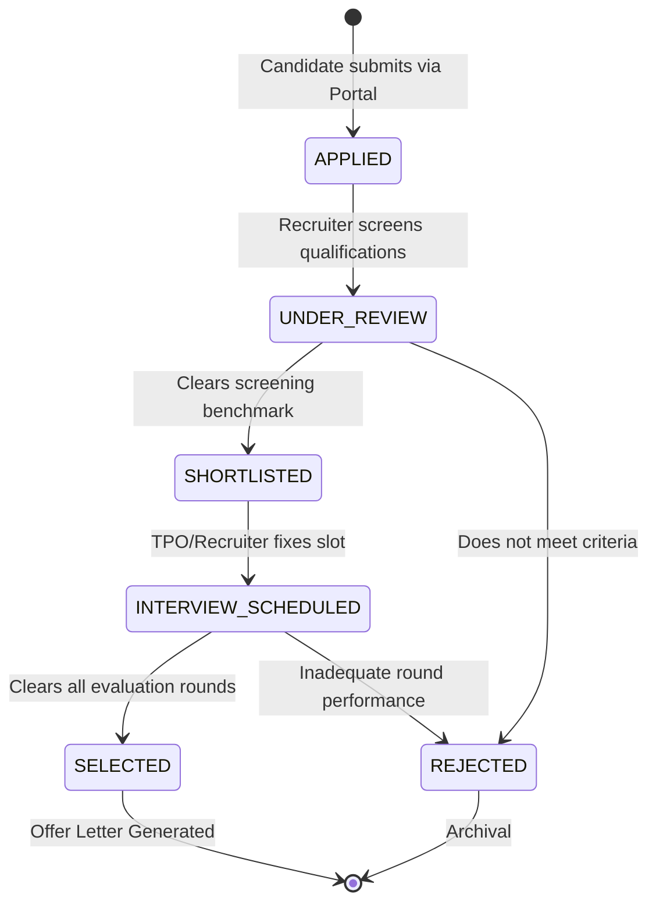

# Candidate Application Workflow & Audit Ledger Tracking
## Module 5: Database Architecture, Integration Layer & System Testing
### Author: Himanshu Yadav ([@XXHimanshuXX](https://github.com/XXHimanshuXX) | [LinkedIn](https://www.linkedin.com/in/himanshu-yadav-112ba6376))
### Contact: himanshu.yadav060107@gmail.com
### Project: Campus Placement and Internship Portal

---

## 1. Candidate Application State Machine

The recruitment journey progresses through a deterministic finite-state automaton:

---

## 2. Atomic Audit Tracking in `ApplicationDAOImpl`

When status transitions occur, both the `applications` row and an audit ledger entry in `application_status_history` are written in a single ACID transaction (`conn.commit()`), ensuring complete auditability.
