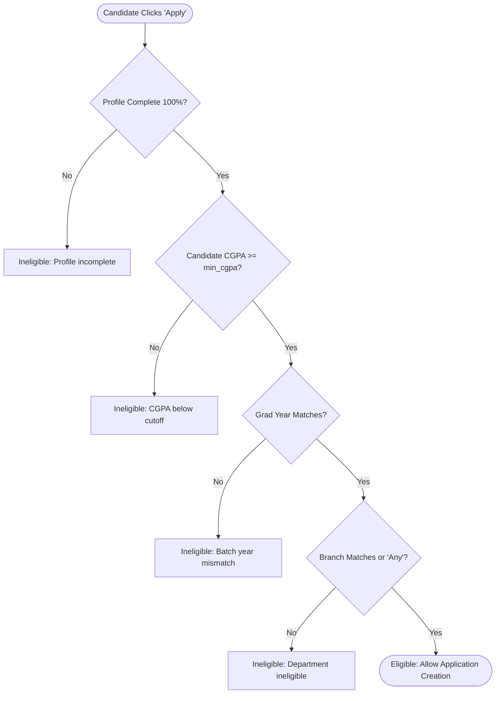

# Automated Eligibility Engine Architecture
## Module 5: Database Architecture, Integration Layer & System Testing
### Author: Himanshu Yadav ([@XXHimanshuXX](https://github.com/XXHimanshuXX) | [LinkedIn](https://www.linkedin.com/in/himanshu-yadav-112ba6376))
### Contact: himanshu.yadav060107@gmail.com
### Project: Campus Placement and Internship Portal

---

## 1. Eligibility Engine Objective & Decision Tree

To enforce institutional placement policies and eliminate disqualified applicant clutter for recruiting partners, `EligibilityService.java` executes a 4-tier validation pipeline:

---

## 2. Evaluation Rules Specification

- **Tier 1 (Profile Verification)**: Enforces `calculateProfileCompletion() == 100%`.
- **Tier 2 (CGPA Cutoff)**: Rejects applicants whose CGPA is below company cutoff.
- **Tier 3 (Batch Alignment)**: Verifies student graduation year against targeted drive batch.
- **Tier 4 (Department Eligibility)**: Evaluates comma-delimited branch lists with case-insensitive tokenization.
