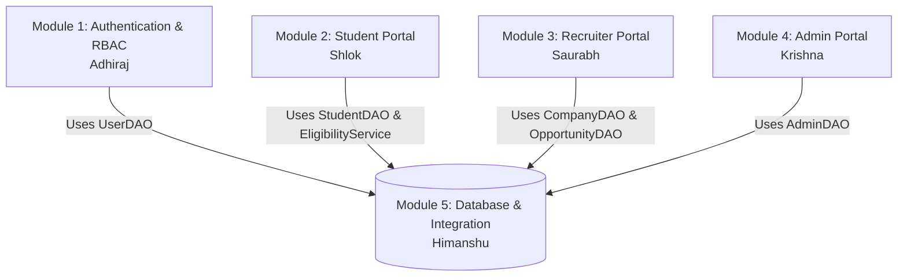

# Cross-Module Integration Contracts & Collaboration Guide
## Module 5: Database Architecture, Integration Layer & System Testing
### Author: Himanshu Yadav ([@XXHimanshuXX](https://github.com/XXHimanshuXX) | [LinkedIn](https://www.linkedin.com/in/himanshu-yadav-112ba6376))
### Contact: himanshu.yadav060107@gmail.com
### Project: Campus Placement and Internship Portal

---

## 1. Team Integration Matrix

As Lead for **Module 5 (Database, Integration & Testing)**, I defined the public interfaces and integration contracts connecting all five project modules:

---

## 2. Integration Interfaces & Consumer Contracts

### 2.1 Module 1 (Authentication - Adhiraj) Integration
- **Interface**: `com.placement.dao.UserDAO`
- **Controllers**: `LoginServlet`, `RegisterServlet`

### 2.2 Module 2 (Student Portal - Shlok) Integration
- **Interfaces**: `StudentDAO`, `OpportunityDAO`, `ApplicationDAO`, `EligibilityService`
- **Controllers**: `StudentProfileServlet`, `StudentOpportunityServlet`, `StudentApplicationServlet`

### 2.3 Module 3 (Recruiter Portal - Saurabh) Integration
- **Interfaces**: `CompanyDAO`, `OpportunityDAO`, `ApplicationDAO`
- **Controllers**: `RecruiterProfileServlet`, `OpportunityServlet`, `RecruiterApplicationServlet`

### 2.4 Module 4 (Admin Portal - Krishna) Integration
- **Interface**: `com.placement.dao.AdminDAO`
- **Controller**: `AdminDashboardServlet`
