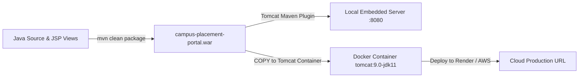

# DevOps & Container Deployment Manual
## Module 5: Database Architecture, Integration Layer & System Testing
### Author: Himanshu Yadav ([@XXHimanshuXX](https://github.com/XXHimanshuXX) | [LinkedIn](https://www.linkedin.com/in/himanshu-yadav-112ba6376))
### Contact: himanshu.yadav060107@gmail.com
### Project: Campus Placement and Internship Portal

---

## 1. Overview of Deployment Architecture

The **Campus Placement and Internship Portal** is packaged as a standard Java Web Application Archive (`.war`) deployable to any Servlet 4.0 compliant container.

This document details:
1. **Local Maven Build & Embedded Tomcat Execution**
2. **Docker Multi-Stage Containerization**
3. **Cloud Production Deployment (Docker / Tomcat / Cloud MySQL)**



---

## 2. Option 1: Local Maven Compilation & Run

```bash
mvn clean package -DskipTests
mvn tomcat7:run
```
Access at: `http://localhost:8080/campus-placement-portal`

---

## 3. Option 2: Docker Container Build & Run

```bash
docker build -t campus-placement-portal:latest .
docker run -d -p 8080:8080 --name placement-portal campus-placement-portal:latest
```
Access at: `http://localhost:8080/`
